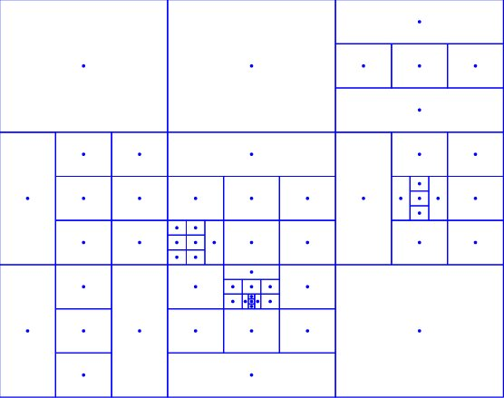
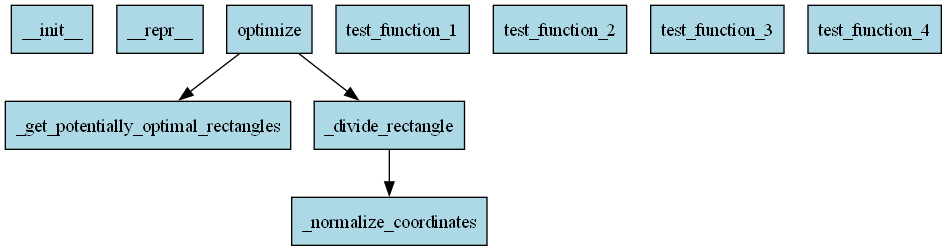

## DIRECT (DIviding RECTangles) algorithm for global optimization



The DIRECT (DIviding RECTangles) optimization technique, which is used to minimize a user-defined objective function f, is implemented in this project. f can be non-linear, non-convex, multi-modal, and non-differentiable. It is also Lipschitz continuous. There is no information about f's Lipschitz constant. We suppose that the feasible region X is the only place where f may be evaluated. To put it another way, we are unable to obtain further details about the objective function, like its gradient or Hessian. When the structure of f is unknown, unexploitable, or nonexistent, this is referred to as Black-Box Optimization (BBO).

In a variety of domains, including engineering design (e.g., airfoil shape optimization), machine learning (e.g., hyperparameter tuning), finance (e.g., portfolio optimization), and drug discovery (e.g., molecular structure identification), black-box optimization problems - in which the objective function is assessed through simulations, experiments, or intricate computations - occur. Since these applications are diverse, there is an increasing need for reliable and effective BBO algorithms that can deal with many types of problems. 

One method for resolving BBO problems is DIRECT. For black-box functions with bound constraints, it is a deterministic global optimization procedure. It iteratively partitions hyperrectangles in the search space, sampling at their centers. Using a convex hull criterion based on size (diameter) versus function value, the program chooses "potentially optimal hyperrectangles" (POH) and divides them into thirds along their longest side or sides. This requires no gradient information and strikes a balance between exploring wide regions and exploiting promising locations. Until convergence conditions on function value change, rectangle size, iterations or number of function evaluations  limitations are met, DIRECT keeps dividing. This project implements the DIRECT algorithm's basic version, which was initially introduced in reference [1].

## Prerequisites

* The following Python packages are required:

1. numpy
2. typing

## Quick Start

* Clone or download the repository
* Open the project directory in VS Code or other Integrated Development Environment (IDE)
* Run the main script (main.py)

## Dependency graph



## Algorithm Flowchart

``` 
Start
  ↓
Initialize DIRECTOptimizer
  ├── Validate: max_feval ≥ min_feval
      ├── If false → Print error & exit
      └── If true → Continue
  ├── Function: black-box objective
  ├── Bounds: per dimension constraints
  └── Parameters: max_iter, max_feval, min_feval, eps, vol_tol, size_tol
  ↓
Initialize Search Space
  ├── Evaluate center point
  ├── Create unit hypercube rectangle
  └── Initialize best solution tracker
  ↓
Main Optimization Loop (while iterations < max_iter)
  ├── Check Termination Criteria
      ├── If feval_count ≥ max_feval → Return "max fevals reached"
      └── Else → Continue
  ├── Identify Potentially Optimal Rectangles
      ├── Sort rectangles by diameter
      ├── Start with best value rectangle
      ├── Find lower convex hull of (diameter, value)
      └── Select rectangles on convex hull
          ├── Calculate slopes where diameters differ
          ├── Handle equal diameters (no division by zero)
          └── Test intermediate points
  ├── Divide Selected Rectangles
      └── For each potentially optimal rectangle:
          ├── Check if small enough (diameter < size_tol or volume < vol_tol)
              ├── Yes → Keep unchanged
              └── No → Proceed to divide
          ├── Find longest side(s)
          ├── Choose division dimension (avoid consecutive same dimension)
          ├── Calculate new side lengths (divide by 3)
          ├── Create 2 new rectangles (offset ±L/3)
          ├── Evaluate at new centers
          └── Update best solution if improved
  ├── Update Rectangle Collection
      ├── Keep non-potentially optimal rectangles
      └── Add newly created rectangles
  └── Check Convergence
      └── If feval_count > min_feval:
          ├── Compare with previous best value
          ├── If |change| < eps → Return "converged"
          └── Else → Update previous best & continue
  ↓
If loop ends without convergence → Return "max iterations reached"
  ↓
Return Final Result
  ├── Best solution found
  ├── Best function value
  ├── Statistics (iterations, evaluations)
  ├── Success status
  └── Termination message
  ↓
End
```

## Results

```
============================================================
Example 1: Minimizing Sphere function (2D)
============================================================
Best solution: [0. 0.]
Best value: 0.00000000
Iterations: 5
Function evaluations: 13
Success: True
Message: Converged (|f_change| < 0.0001)

============================================================
Example 2: Minimizing Rastrigin function (3D)
============================================================
Best solution: [0. 0. 0.]
Best value: 0.00000000
Iterations: 5
Function evaluations: 11
Success: True
Message: Converged (|f_change| < 0.0001)

============================================================
Example 3: Minimizing Ackley function (3D)
============================================================
Best solution: [0. 0. 0.]
Best value: 0.00000000
Iterations: 5
Function evaluations: 11
Success: True
Message: Converged (|f_change| < 0.0001)

============================================================
Example 4: Minimizing Rosenbrock function (2D)
============================================================
Best solution: [0.99999153 1.00000847]
Best value: 0.00000006
Iterations: 24
Function evaluations: 1039
Success: True
Message: Converged (|f_change| < 0.0001)
```

## License
See LICENSE.

## Contributing
We welcome contributions! Areas of particular interest are as mentioned in section 3 of reference [2]. A very good review of real-world applications of DIRECT-type algorithms in the literature can be found in Table 1 of reference [3], the details of which are presented in Table 2 of the same reference. Long way to go! Please see [CONTRIBUTING.md](https://contributing.md/) for guidelines.

## Support
For questions, issues, or feature requests either open an issue on GitHub Issues or contact me directly through email at gpapazafeiropoulos@yahoo.gr

## References

1. **DIRECT algorithm** 

Jones, D. R., Perttunen, C. D., & Stuckman, B. E. (1993). Lipschitzian optimization without the Lipschitz constant. Journal of optimization Theory and Applications, 79(1), 157-181.

2. **Extensions of DIRECT** 

Jones, D. R., & Martins, J. R. (2021). The DIRECT algorithm: 25 years Later. Journal of global optimization, 79(3), 521-566.

3. **Review of applications and problems of DIRECT**

Stripinis, L., & Paulavičius, R. (2025). Review and Computational Study on Practicality of Derivative-Free DIRECT-Type Methods. Informatica, 36(1), 141-174.
